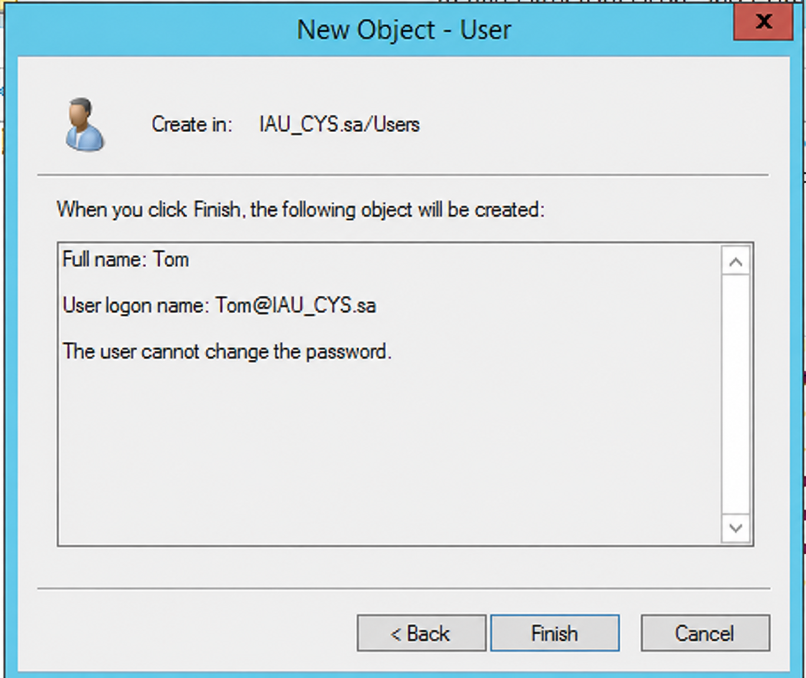

# Creating Users & Groups in Active Directory

This section covers the creation of user accounts and security groups in Active Directory.

Users are created with different roles and permissions, then organised into groups to simplify access management. Instead of assigning permissions to individual users, permissions are assigned to groups, and users inherit access based on group membership.\
\
for this this lab my admin account will be `Tom` and my individual account will be `Jerry`.

## 1- Creating Users

Open Server Manager Dashboard click on **tools** ⇒ **Active Directory Users and Computers**

<figure><figcaption></figcaption></figure>

Then click right on Users ⇒ New ⇒ User

<figure><figcaption></figcaption></figure>

Chose a name and user name and set password and write it store it somewhere

<figure><figcaption></figcaption></figure> <figure><figcaption></figcaption></figure> <figure><figcaption></figcaption></figure>

We need to create another user with the option “User must change password at next logon”.

<figure><figcaption></figcaption></figure> <figure><figcaption></figcaption></figure>

### Testing Login After Creating Users

Click on “Log in with another account” and ensure that the domain is specified.\
If it is not displayed, manually enter it using the following format:

DomainName\Username

<figure><figcaption></figcaption></figure> <figure><figcaption></figcaption></figure>

### 2- Creating Groups

Right on Users ⇒ New ⇒ Group

<figure><figcaption></figcaption></figure> <figure><figcaption></figcaption></figure>

### adding members in the Group

you have 2 way to add member in group:

first way:\
Double click on the group ⇒ Members ⇒ Add

<figure><figcaption></figcaption></figure> <figure><figcaption></figcaption></figure>

Write the user name then click on "Check Names"

<figure><figcaption></figcaption></figure> <figure><figcaption></figcaption></figure>

Second way :\
\
Double click on your user ⇒ Members of ⇒ Add

Enter the group name then click on "Check Names"

<figure><figcaption></figcaption></figure> <figure><figcaption></figcaption></figure>

### In addition your admin account should be member of these groups

\
Administrators\
Domain Admins\
Domain Users\
Schema Admins

<figure><figcaption></figcaption></figure>
